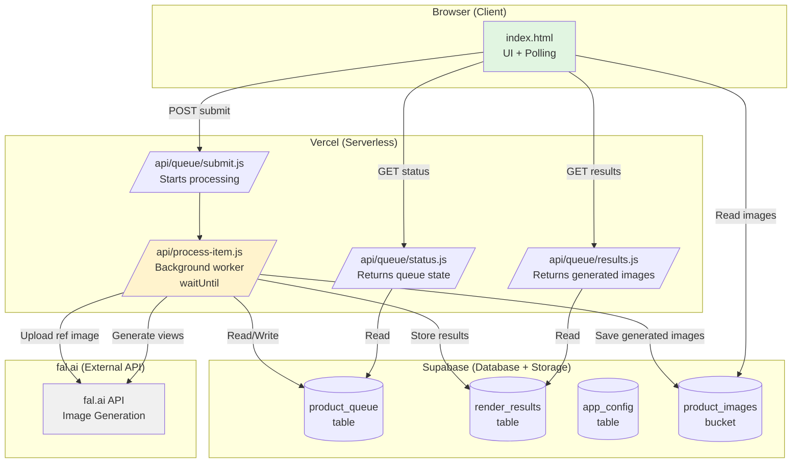

# Server-Side Processing Architecture Plan

## Problem Statement

The current app runs entirely in the browser. When the user closes the browser:
- All in-flight fal.ai API calls are aborted
- The JavaScript execution context is destroyed
- Queue processing stops completely

The user wants rendering to continue even when the browser is closed.

## Root Cause

fal.ai API calls are HTTP requests made from browser JavaScript. They are not server-side background jobs. When the browser tab/process dies, the requests are cancelled.

## Proposed Solution: Hybrid Server-Client Architecture

### Overview

Move the **queue processing** (fal.ai API calls) to **Vercel serverless functions** that run on Vercel's servers, not in the browser. The frontend becomes a **UI + polling client** that submits jobs and displays results.

### Key Technology: `waitUntil()`

Vercel Edge Functions support `waitUntil(promise)` — this allows the function to **return a response immediately** but **continue executing background work**. This is critical because fal.ai calls take 10-60 seconds, which exceeds typical HTTP timeouts.

---

## Architecture Diagram



---

## Data Flow

### 1. User Uploads Image
```
Browser → Supabase Storage (product_images bucket)
Browser → Supabase Database (product_queue table: status='wait')
```

### 2. User Clicks "Start Queue"
```
Browser → POST /api/queue/submit
  → API loads item from Supabase
  → API calls waitUntil(processItem(itemId))
  → API returns immediately: { status: 'processing', itemId }
  → Background work continues on Vercel servers!
```

### 3. Background Processing (on Vercel server)
```
api/process-item.js:
  1. Load item from product_queue
  2. Upload reference image to fal.ai CDN
  3. For each of 5 views:
     a. Call fal.ai API (takes 10-60s)
     b. On success: save image to Supabase Storage
     c. Insert record into render_results table
     d. Update product_queue status
  4. Mark item as DONE in product_queue
```

### 4. Frontend Polling (every 3 seconds)
```
Browser → GET /api/queue/status
  → Returns current status of all queue items
  → Frontend updates UI (progress bars, badges, etc.)
```

### 5. User Reopens Browser (auto-resume)
```
Browser init:
  1. Load queue from Supabase
  2. Check for items with status='active' or 'wait'
  3. Auto-call POST /api/queue/submit for active/wait items
  4. Start polling loop
```

---

## Database Schema Changes

### New Table: `render_results`

```sql
CREATE TABLE public.render_results (
  id              UUID PRIMARY KEY DEFAULT gen_random_uuid(),
  queue_id        BIGINT NOT NULL REFERENCES public.product_queue(id) ON DELETE CASCADE,
  view_id         INTEGER NOT NULL,        -- 1-5 (front, side, isometric, back, interior)
  view_label      TEXT NOT NULL,           -- e.g. 'Front view'
  status          TEXT DEFAULT 'pending',  -- pending, generating, done, error, stopped
  image_url       TEXT,                    -- URL to generated image in Supabase Storage
  image_data      BYTEA,                   -- Optional: store small base64 directly
  error_message   TEXT,
  attempt_count   INTEGER DEFAULT 0,
  created_at      TIMESTAMPTZ DEFAULT NOW(),
  updated_at      TIMESTAMPTZ DEFAULT NOW(),
  UNIQUE(queue_id, view_id)
);

ALTER TABLE public.render_results ENABLE ROW LEVEL SECURITY;

CREATE POLICY "Allow all on render_results"
  ON public.render_results
  FOR ALL
  USING (true)
  WITH CHECK (true);
```

### Updated Table: `product_queue`

```sql
-- Add columns for tracking processing state
ALTER TABLE public.product_queue 
  ADD COLUMN IF NOT EXISTS parallelism INTEGER DEFAULT 1,
  ADD COLUMN IF NOT EXISTS resolution   TEXT DEFAULT '0.5K',
  ADD COLUMN IF NOT EXISTS started_at   TIMESTAMPTZ,
  ADD COLUMN IF NOT EXISTS completed_at TIMESTAMPTZ,
  ADD COLUMN IF NOT EXISTS error_count  INTEGER DEFAULT 0;
```

---

## API Endpoints

### `POST /api/queue/submit`
**Purpose:** Start processing one or more queue items

**Request:**
```json
{
  "itemIds": [1, 2, 3]
}
```

**Response:**
```json
{
  "status": "processing",
  "submitted": [1, 2, 3],
  "alreadyProcessing": []
}
```

**Implementation:**
- Load items from Supabase
- Filter out already-processing items
- For each item: update status='active', call `waitUntil(processItem(itemId))`
- Return immediately

---

### `GET /api/queue/status`
**Purpose:** Get current status of all queue items with their render results

**Response:**
```json
{
  "items": [
    {
      "id": 1,
      "name": "chair.jpg",
      "status": "active",
      "viewsCompleted": 2,
      "viewsTotal": 5,
      "results": [
        { "viewId": 1, "status": "done", "imageUrl": "https://..." },
        { "viewId": 2, "status": "generating" },
        { "viewId": 3, "status": "pending" }
      ]
    }
  ]
}
```

---

### `GET /api/queue/results`
**Purpose:** Get completed render results for a specific item

**Query:** `?itemId=1`

**Response:**
```json
{
  "itemId": 1,
  "status": "done",
  "results": [
    { "viewId": 1, "viewLabel": "Front view", "imageUrl": "https://..." },
    { "viewId": 2, "viewLabel": "Side view", "imageUrl": "https://..." },
    ...
  ]
}
```

---

### `POST /api/process-item` (Internal/Triggered)
**Purpose:** Background worker that processes a single queue item

**Request:**
```json
{ "itemId": 1 }
```

**Implementation (pseudocode):**
```javascript
export default async function handler(request) {
  const { itemId } = await request.json();
  
  // Start background processing
  const processingPromise = (async () => {
    const item = await loadItemFromSupabase(itemId);
    if (!item || item.status !== 'wait') return;
    
    await updateItemStatus(itemId, 'active');
    
    // Upload reference image to fal.ai
    const imageUrl = await uploadToFal(item.image_url);
    
    // Generate 5 views
    for (const view of VIEWS) {
      await updateRenderStatus(itemId, view.id, 'generating');
      try {
        const result = await callFalEdit(view, imageUrl);
        const storedUrl = await saveGeneratedImage(result);
        await saveRenderResult(itemId, view.id, 'done', storedUrl);
      } catch (error) {
        await saveRenderResult(itemId, view.id, 'error', null, error.message);
      }
    }
    
    // Mark complete
    const doneCount = await countDoneResults(itemId);
    const finalStatus = doneCount === 5 ? 'done' : 'error';
    await updateItemStatus(itemId, finalStatus);
  })();
  
  // Return immediately, keep processing in background
  waitUntil(processingPromise);
  
  return Response.json({ status: 'processing', itemId });
}
```

---

## File Structure

```
productgenerator/
├── index.html                    # Frontend (UI + polling, no API calls)
├── api/
│   ├── queue/
│   │   ├── submit.js             # POST - Start processing queue items
│   │   ├── status.js             # GET - Get queue + results status
│   │   └── results.js            # GET - Get completed render images
│   └── process-item.js           # POST - Background worker (waitUntil)
├── lib/
│   ├── supabase.js               # Shared Supabase client config
│   └── fal.js                    # Shared fal.ai API logic
├── package.json                  # Updated with API dependencies
├── vercel.json                   # Updated with routes + maxDuration
└── supabase_setup.sql            # Updated schema
```

---

## Frontend Changes Required

### Removed from Browser:
- All fal.ai API calls (`uploadToFal`, `generateView`, `callFalEdit`)
- Image upload to fal.ai CDN (moved to server)
- Retry logic (moved to server)
- The `startBtn` click handler's processing loop

### Added to Browser:
- **Polling loop:** Every 3-5 seconds, call `GET /api/queue/status`
- **Auto-resume on load:** Check for `status='active'` items, call `/api/queue/submit`
- **Progress display:** Update UI based on poll results (view badges, progress bars)
- **Image display:** Load completed images from Supabase Storage URLs

### Modified Components:
- `createActiveCard()` — now shows progress based on poll data, not live generation
- `startBtn` click handler — now calls API instead of running local loop
- `init()` — auto-submits active items on load

---

## Deployment Configuration

### `vercel.json` Updates

```json
{
  "buildCommand": "npm run build",
  "outputDirectory": "dist",
  "functions": {
    "api/process-item.js": {
      "maxDuration": 300
    }
  },
  "rewrites": [
    { "source": "/api/(.*)", "destination": "/api/$1" },
    { "source": "/(.*)", "destination": "/index.html" }
  ]
}
```

### Environment Variables (Vercel Dashboard)

| Variable | Value |
|----------|-------|
| `FAL_API_KEY` | Your fal.ai API key |
| `SUPABASE_URL` | Supabase project URL |
| `SUPABASE_ANON_KEY` | Supabase anon public key |
| `SUPABASE_SERVICE_ROLE_KEY` | Supabase service role key (for server-side access) |

---

## Security Considerations

1. **API Key Storage:** fal.ai API key stored only in Vercel environment variables (server-side only)
2. **Supabase Service Role:** Server uses service role key for full database access; client uses anon key with RLS
3. **CORS:** API routes configured to accept requests from the app's domain
4. **Rate Limiting:** Optional — add rate limiting on `/api/queue/submit`

---

## Limitations & Trade-offs

| Aspect | Before (Browser) | After (Serverless) |
|--------|-----------------|-------------------|
| **Close browser?** | Stops immediately | Continues on Vercel servers |
| **Cost** | Free (uses user's browser) | Free tier: 100GB-hours/month (Vercel Hobby) |
| **Timeout risk** | N/A (browser tab lives until closed) | `maxDuration: 300s` — 5 products max per invocation |
| **Parallelism** | Configurable (1-4) | Can increase — server handles more |
| **Complexity** | Single HTML file | Requires API routes + shared libs |
| **Cold start** | N/A | ~50-200ms for Edge Functions |
| **Retry on timeout** | Manual | Can implement server-side retry with backoff |

---

## Implementation Phases

### Phase 1: Backend API Routes
- Create `/api/queue/submit`
- Create `/api/queue/status`
- Create `/api/process-item` with `waitUntil`
- Create shared `lib/supabase.js` and `lib/fal.js`

### Phase 2: Database Schema
- Add `render_results` table
- Update `product_queue` with new columns
- Add storage bucket for generated images

### Phase 3: Frontend Refactoring
- Remove browser-side fal.ai calls
- Add polling loop (3-5 second interval)
- Update UI components to use poll data
- Implement auto-resume on load

### Phase 4: Testing & Polish
- Test close-browser-and-reopen flow
- Test auto-resume behavior
- Add error handling for API failures
- Optimize polling frequency

---

## Estimated Effort

- **Phase 1:** ~40 lines of new API code (reusing existing logic)
- **Phase 2:** ~30 lines of SQL
- **Phase 3:** ~100 lines of frontend refactoring (mostly removing code)
- **Phase 4:** ~20 lines of polish

**Total:** ~190 lines of new/changed code. The heavy lifting (fal.ai integration, prompts, retry logic) already exists and just moves from browser to server.
